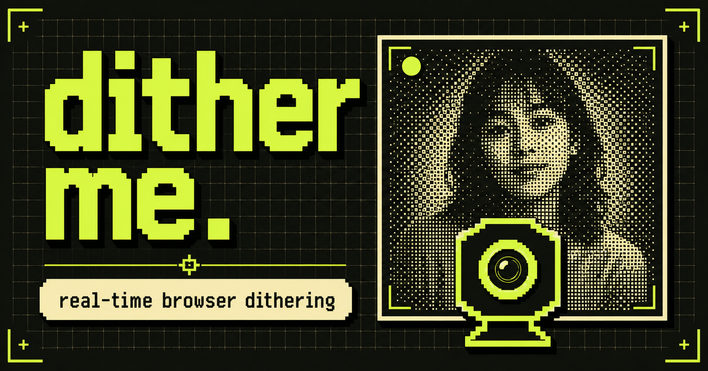

# dither me.

**A real-time, one-bit webcam studio by [Gumbo](https://hellogumbo.com).**

[Open dither me →](https://ditherme.vercel.app)



`dither me` turns a live camera feed into a moving Bayer-dither portrait directly in the browser. Adjust the texture, choose the ink color, capture a frame, and download it as a PNG.

Nothing is recorded. Nothing is uploaded.

## What it does

- Processes the webcam in real time with the Canvas API
- Applies an ordered Bayer 4×4 dither to every frame
- Adjusts pixel size, contrast, and threshold live
- Changes the dither ink color with a picker and preset palette
- Mirrors the camera for a natural selfie view
- Captures the processed frame and downloads it as a PNG
- Keeps controls in a collapsible overlay so the image stays front and center
- Adapts the controls into a compact expandable panel on mobile

## Privacy

Camera access happens through the browser's `getUserMedia` API. Video frames are processed locally on the device and drawn to a canvas. The app has no upload, recording, account, analytics, or storage flow.

## Run it locally

Requires Node.js `22.13.0` or newer.

```bash
git clone https://github.com/hellogumbo/ditherme.git
cd ditherme
npm install
npm run dev
```

Open [http://localhost:3000](http://localhost:3000), select **Start camera**, and allow camera access when prompted.

## Useful commands

```bash
npm run dev      # Start the local development server
npm run build    # Create a production build
npm run lint     # Run ESLint
npm test         # Build and run the rendered HTML test
```

## How the effect works

Each video frame is sampled at the selected pixel size, converted to luminance, adjusted for contrast, and compared against a Bayer 4×4 threshold matrix. The result is mapped to two colors: near-black and the selected ink color. A second canvas scales the captured result back to the camera's full resolution with smoothing disabled, preserving the crisp pixel texture.

## Built with

- [React 19](https://react.dev)
- [Next.js 16](https://nextjs.org)
- [vinext](https://github.com/cloudflare/vinext)
- Canvas API and `getUserMedia`
- PP Mondwest and PP Neue Montreal Mono

## Deployment

The `main` branch deploys automatically to Vercel at [ditherme.vercel.app](https://ditherme.vercel.app).

---

Made by [Gumbo](https://hellogumbo.com) — an AI-first product and engineering studio.
